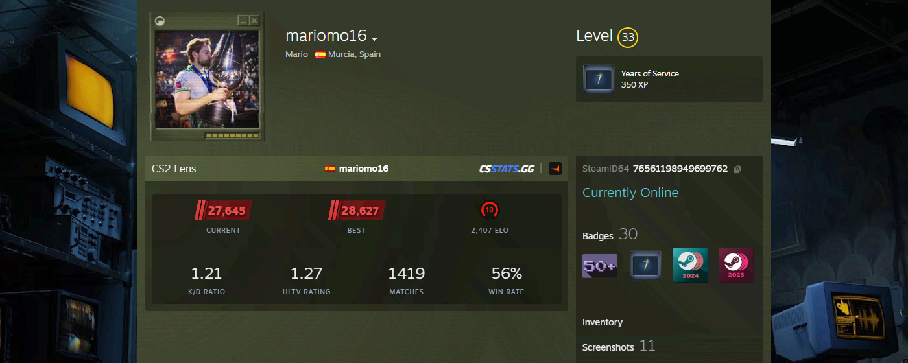

# CS2 Vision

<picture>
  
</picture>

View CS2 stats on Steam: K/D, HLTV rating, matches, winrate. Includes integrated Faceit level and Elo tracking.

## Features

- **CS2 Premier Ratings** — Current and best season ratings with tier-based color and SVG badges
- **General Stats** — K/D Ratio, HLTV Rating, Matches played, and Win Rate (aggregated from Competitive, Premier, FACEIT, and ESEA 5v5 matches)
- **FACEIT Integration** — Skill level, ELO, player name, country flag, and profile link
- **Verified Badge** — Displays a verified icon next to the FACEIT name for VIP verified accounts
- **Challenger Badges** — Regional top 1000 players show the regional challenger badge with rank
- **Tracking Status** — Detects disabled or inactive match tracking and shows a contextual message
- **Private Profile Handling** — Displays a message when the csstats.gg profile is private
- **SteamID64 Display** — Auto-detected and shown below the profile info
- **Data Sources** — Pulls from csstats.gg and faceit.com

## Tech Stack

| Layer    | Choice                         |
| -------- | ------------------------------ |
| Runtime  | Chrome Extension (Manifest V3) |
| Language | TypeScript 6                   |
| Bundler  | esbuild                        |
| Worker   | Service Worker (background.js) |
| DOM      | Native APIs (no frameworks)    |

## Build

```bash
pnpm install
pnpm build
```

Output goes to `dist/` (content.js, background.js).

Load as an unpacked extension in `chrome://extensions/` (developer mode).

## License

MIT
