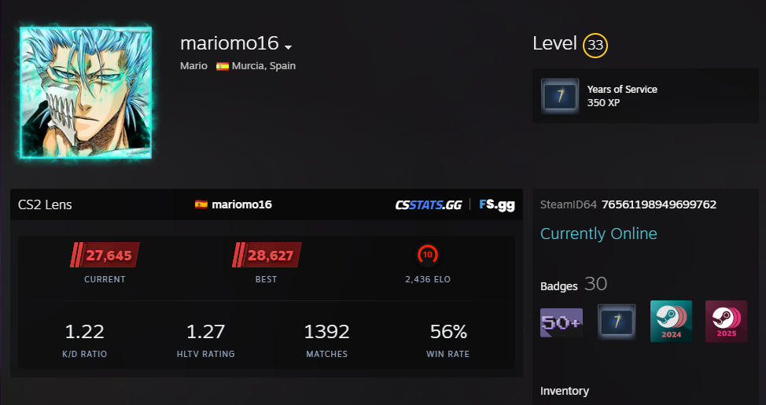

# CS2 Lens

<picture>
  
</picture>

Enhance any Steam Community profile with CS2 stats, FACEIT rankings, and (soon) inventory value — all without leaving the page.

## Features

- **CS2 Premier Ratings** — Current and best season ratings with tier-based color and SVG badges
- **General Stats** — K/D Ratio, HLTV Rating, Matches played, and Win Rate
- **FACEIT Integration** — Skill level, ELO, regional flags, and profile link
- **Challenger Badges** — Top 1000 global players get challenger SVGs (#1, #2, #3, and challenger tier)
- **Placeholder UX** — FACEIT block shows "Unranked" until stats load, preventing layout shift
- **Tracking Status** — Detects disabled or inactive match tracking with contextual warnings
- **SteamID64 Display** — Auto-detected and shown below the profile info
- **Data Sources** — Pulls from csstats.gg (MM/Premier) and faceitstats.gg (FACEIT)

## Tech Stack

| Layer    | Choice                         |
| -------- | ------------------------------ |
| Runtime  | Chrome Extension (Manifest V3) |
| Language | TypeScript 6                   |
| Bundler  | esbuild                        |
| Worker   | Service Worker (background.js) |
| DOM      | Native APIs (no frameworks)    |

## Architecture

```
src/
├── content.ts          # Entry point — extracts SteamID, orchestrates data fetching
├── background.ts       # Service worker — proxies fetch to csstats.gg and faceitstats.gg
├── modules/
│   ├── csstats.ts      # API clients, types, and response parsing
│   ├── showcase.ts     # UI rendering functions for all stat blocks
│   └── ui.ts           # Shell construction, page insertion, SteamID display
```

**Flow:**

1. `content.ts` extracts `steamId64` from the page and calls `fetchPlayerStats` (csstats.gg)
2. A widget shell is created and inserted into the Steam profile
3. Premier ratings and general stats are rendered immediately
4. A FACEIT placeholder (unranked SVG + "Unranked" label) is added to reserve space
5. `fetchFaceitStats` (faceitstats.gg) resolves asynchronously — the placeholder is replaced with real level/ELO/challenger data
6. FACEIT nickname and country flag appear in the header, linked to faceit.com

## Best Practices

- **No framework lock-in** — Pure DOM APIs keep the bundle small and maintainable
- **Reliable async** — FACEIT fetch uses `.then()` so the widget renders even if it never resolves
- **No layout shifts** — Placeholder blocks reserve space before slow data arrives
- **Soft error handling** — Every fail path returns null/graceful fallback; no thrown exceptions
- **Type safety** — Strict TS with discriminated unions (`StatsResponse`) for exhaustive error handling
- **Minimal permissions** — Only `host_permissions` for the two API origins; no `storage`, `cookies`, etc.
- **Feature detection** — Tracks both "tracking not enabled" and "tracking inactive" states from csstats.gg

## Build

```bash
pnpm install
pnpm build
```

Output goes to `dist/` (content.js, background.js).

Load `dist/` as an unpacked extension in `chrome://extensions/` (developer mode).

## Upcoming

- **Inventory value** — Fetch and display the total Steam inventory price of the profile owner using CSFloat prices

## License

MIT
